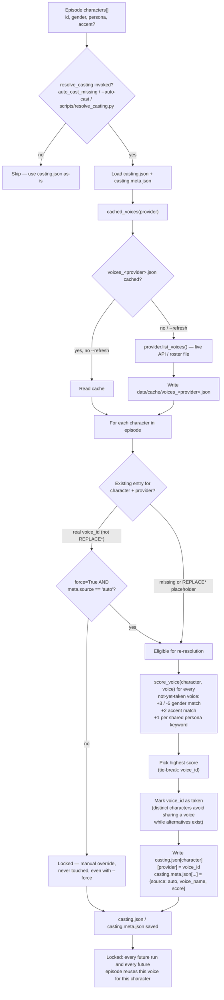

# Integration Guide

This guide explains how to wire the voice pipeline into a larger system (or
just run it standalone), and documents the two flows that matter most when
debugging output: **how a character gets a voice** (casting) and **how an
episode script becomes an audio file** (synthesis). For a quick-start CLI
cheat sheet, see [README.md](README.md) — this doc goes one level deeper.

## 1. What this pipeline is

A provider-agnostic TTS pipeline: you give it an `episode.json` script
(characters + timed, emotion-tagged dialogue lines), it gives you back a
stitched, loudness-normalized `.mp3` plus a manifest. The vendor doing the
actual text-to-speech (Sarvam, ElevenLabs, a mock silence generator for
testing) is a swappable adapter behind one interface
(`providers/base.py::TTSProvider`) — nothing in `pipeline/` or `main.py`
knows which vendor is active.

```
episode.json ──▶ orchestrator ──▶ [provider adapter] ──▶ audio_post ──▶ episode.mp3 + manifest.json
                      │                                        │
                config/casting.json                    config/bgm_map.yaml (optional)
                config/emotion_map.yaml
```

## 2. Integrating it into another system

The pipeline is invoked either as a CLI (`main.py`) or by importing
`pipeline.orchestrator.run_episode()` + `pipeline.audio_post.build_episode()`
directly from Python — there's no server/API layer here, so integration
means one of:

- **Shell out to `main.py`** from whatever generates your episode scripts
  (a content pipeline, a queue worker, etc.), then read
  `data/output/<episode_id>.mp3` and `_manifest.json` back.
- **Import the two functions directly** if you're already in Python:

  ```python
  from pipeline.orchestrator import run_episode
  from pipeline.audio_post import build_episode

  episode, results, failures = run_episode("data/episodes/ep_014.json")
  out_path, manifest_path, duration_ms = build_episode(episode, results)
  ```

Either way, the contract you need to produce upstream is
`schemas/episode_schema.json` — that's the thing your script-generator (LLM
prompt, editorial tool, whatever writes the dialogue) must target. Required
per line: `line_id`, `speaker`, `text`, `language`, `emotion`, `intensity`.

## 3. Setup

```bash
python -m venv venv && source venv/bin/activate
pip install -r requirements.txt
cp .env.example .env
# paste real SARVAM_API_KEY / ELEVENLABS_API_KEY into .env
```

Verify the pipeline itself (no API credits spent, no network calls):

```bash
python main.py --episode data/episodes/ep_014.json --provider mock
```

## 4. Configuration surface

| File | Purpose |
|---|---|
| `config/config.yaml` | `active_provider` switch, per-provider synthesis params, global pipeline settings (silence gaps, loudness target, retry policy, BGM on/off) |
| `config/casting.json` | Generated lockfile: `character_id -> {provider: voice_id}`. Not hand-edited line by line — see §5. |
| `config/casting.meta.json` | Tracks *how* each `casting.json` entry got there (`source: auto` + score), so the resolver knows what it's allowed to overwrite with `--force` |
| `config/voices.json` | Sarvam's static speaker roster (Sarvam has no voice-search API, so this is hand-maintained) |
| `config/emotion_map.yaml` | Per-provider mapping from the schema's 13 emotions to that vendor's actual synthesis syntax (ElevenLabs bracket tags, Sarvam pace/temperature) |
| `config/bgm_map.yaml` | Emotion → background-ambience text prompt, used only when `--bgm` is on |
| `schemas/episode_schema.json` | The input contract — validated on every run before any API call |

## 5. Voice casting: how a character gets a voice

Casting is resolved **once per character**, then locked. This is what makes
"riya always sounds like riya" true across every episode in a series,
instead of depending on someone remembering to pass the same voice_id every
time.



Key rules worth internalizing:
- **A non-placeholder value is a manual pin.** If you hand-edit
  `casting.json` with a specific voice_id, the resolver treats it as
  intentional and will never overwrite it — not even with `--force`.
- **`--force` only re-resolves what the resolver itself wrote.** It checks
  `casting.meta.json`'s `source: auto` tag, so it can't accidentally
  clobber a manual override.
- **`series_id` namespaces casting keys** (`casting_key()` in
  `pipeline/casting_resolver.py`) so two unrelated shows can each have a
  character named e.g. `priya` without sharing a voice.

## 6. Input → output: how an episode.json becomes an mp3

```mermaid
flowchart TD
    A["episode.json"] --> B["validate_episode():<br/>JSON Schema + line_id uniqueness + speaker references exist"]
    B --> C["Resolve active provider<br/>(config.yaml active_provider, or --provider)"]
    C --> D{"auto_cast enabled?<br/>(--auto-cast or config pipeline.auto_cast_missing)"}
    D -->|yes| E["resolve_casting() per provider in use — see §5"]
    D -->|no| F
    E --> F["validate_provider_coverage():<br/>every speaker cast + every emotion used<br/>is in emotion_map.yaml, BEFORE any API call"]
    F --> G["Load effective casting,<br/>remapped from series-namespaced keys to bare character ids"]
    G --> H["For each line in episode.lines, in script order"]
    H --> I{"Cache hit?<br/>hash(provider, speaker, text, emotion, intensity, pace)"}
    I -->|yes| J["Reuse cached SynthesisResult<br/>(no API call)"]
    I -->|no| K["Build SynthesisRequest"]
    K --> L["provider.resolve_voice_id(speaker, casting)"]
    L --> M["provider.synthesize():<br/>emotion → vendor-specific tag/param via emotion_map.yaml<br/>→ call TTS API → write per-line clip to data/cache/"]
    M --> N["save_to_cache()"]
    N --> O["Append SynthesisResult"]
    J --> O
    O --> P{"More lines?"}
    P -->|yes| H
    P -->|no| Q["audio_post.build_episode()"]
    Q --> R["Per line: load clip, normalize_to_target(loudness)"]
    R --> S["Concatenate clip + pause_after_ms silence;<br/>record start_ms/end_ms per line"]
    S --> T{"bgm_enabled?"}
    T -->|yes| U["build_bgm_track(): mood cues → ElevenLabs<br/>Sound Effects API, cached per mood, looped, gain/ducking"]
    U --> V["Overlay BGM onto the combined dialogue track"]
    T -->|no| W
    V --> W["Export data/output/&lt;episode_id&gt;.mp3"]
    W --> X["Write data/output/&lt;episode_id&gt;_manifest.json:<br/>per-line timing, provider, voice_id, emotion, bgm cues"]
    X --> Y["Return (out_path, manifest_path, duration_ms)"]
```



Two behaviors worth calling out because they're easy to miss reading the
code linearly:
- **Failures don't abort the run.** A single line's `ProviderError` (bad
  API response, quota, etc.) is logged and collected into `failures`; the
  rest of the episode keeps synthesizing. `main.py` only exits non-zero if
  *every* line failed.
- **BGM failure never breaks a run either.** Any exception in
  `build_bgm_track` is caught, logged as a warning, and the episode is
  exported dialogue-only with `manifest["bgm"]["enabled"] = false`.

## 7. Adding a new TTS provider

1. `providers/<name>_provider.py` implementing `TTSProvider` (see `providers/base.py`)
2. Register it in `PROVIDERS` in `providers/factory.py`
3. Add its section to `config/emotion_map.yaml`
4. Cast your characters against it: `python scripts/resolve_casting.py --episode <ep>.json --provider <name>`
5. Set `active_provider: <name>` in `config/config.yaml`, or pass `--provider <name>` per run

Nothing else in `pipeline/` needs to change — that's the point of the
adapter boundary.

## 8. Output artifacts

- `data/output/<episode_id>.mp3` — stitched, loudness-normalized episode
- `data/output/<episode_id>_manifest.json` — per-line timing, provider,
  voice_id, emotion, language, and (if BGM ran) which mood cues were used
- `data/cache/` — per-line clips (safe to delete to force re-synthesis) and
  `data/cache/bgm/` generated ambience beds
